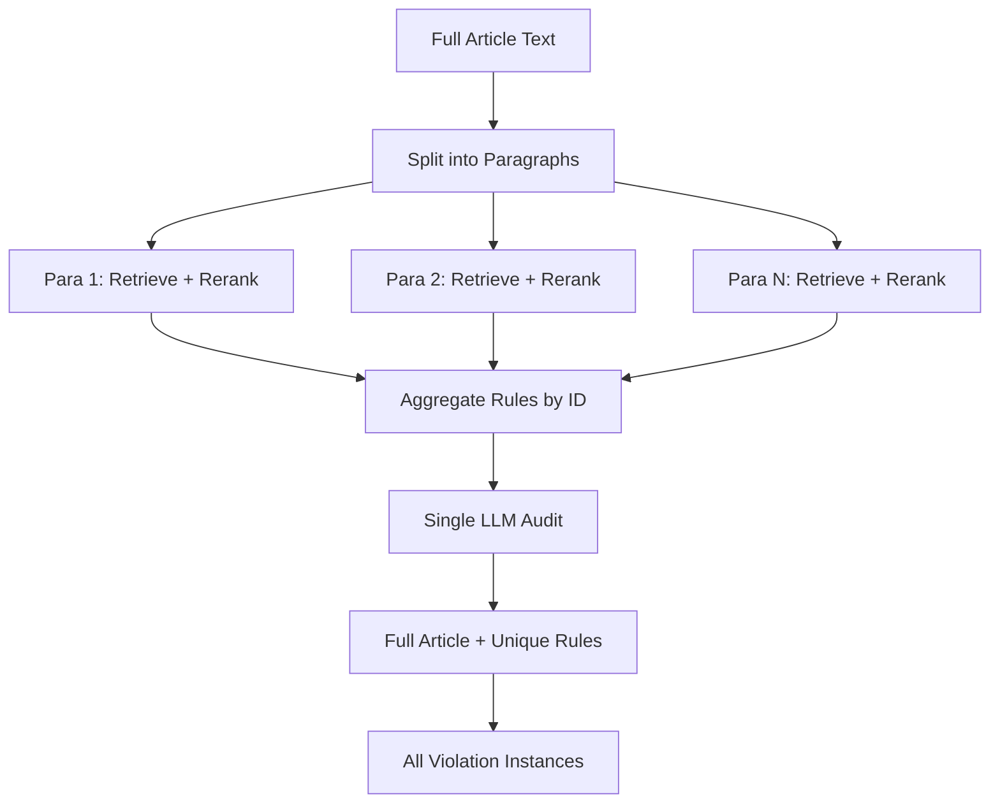

# Two-Stage Full-Article Audit Implementation

## Goal
Replace per-paragraph auditing with a two-stage approach that maintains parallel retrieval but runs a single audit against the full article for better context.

## Architecture Overview



## Key Behavior Changes

| Current | New |
|---------|-----|
| LLM audit per paragraph | Single LLM audit for full article |
| Violations scoped to paragraph | Violations reference full article text |
| N audit calls for N paragraphs | 1 audit call total |
| Limited cross-paragraph context | Full article context |

---

## Proposed Changes

### 1. Auditor Orchestration
#### [MODIFY] [auditor.py](file:///home/robbo/newslabs-rag-style-checker/src/audit/auditor.py)

**Current flow:**
```
for each paragraph:
    - retrieve rules
    - rerank
    - audit paragraph → violations
aggregate all violations
```

**New flow:**
```
Stage 1 (Parallel):
    for each paragraph (in parallel):
        - retrieve rules
        - rerank
        - collect rules (no audit yet)

Stage 2 (Single Pass):
    - aggregate rules by ID (unique set)
    - run single audit against full article + all rules
    - return all violations
```

**Changes:**
- Modify `process_paragraph` to return reranked rules only (no audit).
- Add `_aggregate_rules(all_paragraph_rules) -> unique_rules` helper.
- Add `_audit_full_article(full_text, unique_rules) -> violations` method.
- Remove per-paragraph audit agent calls.

---

### 2. Agent Refactor
#### [MODIFY] [agent.py](file:///home/robbo/newslabs-rag-style-checker/src/audit/agent.py)

**Current:** `audit_paragraph(paragraph)` runs the full pipeline.

**New options:**
- **Option A:** Keep `StyleAgent` but add a new method `audit_full_article(full_text, rules)` that only runs the audit loop (no retrieval).
- **Option B:** Split into `RetrievalAgent` and `AuditAgent` classes.

**Recommendation:** Option A (less refactoring).

**New method signature:**
```python
async def audit_full_article(
    self, 
    full_text: str, 
    rules: List[Dict]
) -> Tuple[List[Dict], List[Dict]]:
    """Run audit loop against full article with pre-fetched rules."""
```

---

### 3. Prompt Update
#### [MODIFY] [prompts.py](file:///home/robbo/newslabs-rag-style-checker/src/audit/prompts.py)

Update `PROMPT_AUDIT_SYSTEM` to clarify that:
- The input is the **full article**, not a single paragraph.
- The LLM should flag **every instance** of a violation, not just the first.

Add instruction:
```
Review the ENTIRE ARTICLE below. Flag EVERY instance where a rule is violated, 
even if the same rule is broken multiple times. Include the exact text snippet 
for each violation.
```

---

### 4. Retrieval-Only Pipeline
#### [MODIFY] [auditor.py](file:///home/robbo/newslabs-rag-style-checker/src/audit/auditor.py)

Create a helper for Stage 1:
```python
async def _retrieve_rules_for_paragraph(
    self, 
    paragraph: str, 
    retriever, 
    reranker
) -> Tuple[List[Dict], Dict]:
    """Retrieve and rerank rules for a single paragraph."""
    rules, retrieval_details = await retriever.retrieve(paragraph)
    reranked, rerank_details = await reranker.rerank(rules, paragraph)
    return reranked, {**retrieval_details, **rerank_details}
```

---

## Detailed Execution Flow

```
1. check_text(full_article) called
2. Split into paragraphs
3. For each paragraph (parallel):
   a. Identify terms, generate queries, retrieve from DB
   b. Rerank results
   c. Return list of rules (no audit)
4. Aggregate all rules, dedupe by rule ID
5. Build prompt with full_article + unique_rules
6. Single LLM audit call
7. Parse violations (each with exact text snippet from article)
8. Return violations + logs
```

---

## Timing Considerations

| Step | Parallelism | Expected Duration |
|------|-------------|-------------------|
| Stage 1 (retrieval per para) | Fully parallel | ~1-3s total |
| Stage 2 (single audit) | Single call | ~2-5s |
| **Total** | | ~3-8s (down from N*2-5s) |

---

## Verification Plan

1. **Unit test:** Mock retriever returns rules, verify aggregation dedupes by ID.
2. **Integration test:** Submit multi-paragraph article, verify single audit call is made.
3. **Output validation:** Confirm same rule can appear in multiple violations with different text snippets.
4. **Timing comparison:** Compare session time before/after for a 5-paragraph article.
